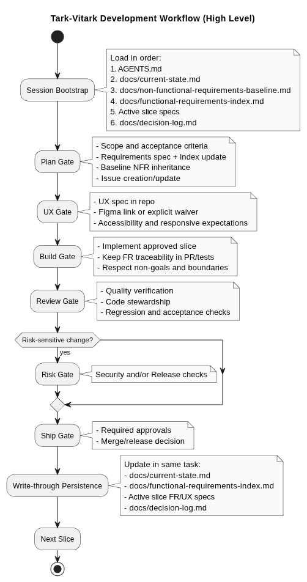

# tark-vitark

Project reset to a clean foundation for fresh development.

## Agentic Collaboration Contract

Shared protocol for all future work:

- [AGENTS.md](AGENTS.md)
- [.github/copilot-instructions.md](.github/copilot-instructions.md)

Current primary agent:

- [.github/agents/studio-architect.agent.md](.github/agents/studio-architect.agent.md)

Additional role-specific agents:

- [.github/agents/ux-strategist.agent.md](.github/agents/ux-strategist.agent.md)
- [.github/agents/product-manager.agent.md](.github/agents/product-manager.agent.md)

## Agent Selection Guide

- Use [.github/agents/studio-architect.agent.md](.github/agents/studio-architect.agent.md) for end-to-end delivery: planning, architecture, implementation, tests, docs, and release-ready increments.
- Use [.github/agents/product-manager.agent.md](.github/agents/product-manager.agent.md) for requirements continuity: functional specs, acceptance criteria quality, and requirement traceability across slices.
- Use [.github/agents/ux-strategist.agent.md](.github/agents/ux-strategist.agent.md) for UI/UX-heavy work: user flows, interaction behavior, accessibility, responsive layouts, and visual direction.
- If a task spans both, start with [Studio Architect Agent](.github/agents/studio-architect.agent.md) for scope and sequencing, then hand focused interface tasks to [UX Strategist Agent](.github/agents/ux-strategist.agent.md).

## Current State

- Previous React/Cra scaffolding has been removed.
- The repository is ready to initialize a new stack from scratch.
- Feature slice issue intake template is available at [.github/ISSUE_TEMPLATE/feature-slice-intake.yml](.github/ISSUE_TEMPLATE/feature-slice-intake.yml).
- Required GitHub labels can be bootstrapped with [scripts/setup-github-labels.sh](scripts/setup-github-labels.sh).
- Startup context for every chat is tracked in [docs/current-state.md](docs/current-state.md).

## Development Workflow Diagram

- PlantUML source: [docs/development-workflow.puml](docs/development-workflow.puml)
- Diagram image: [docs/assets/diagrams/development-workflow.png](docs/assets/diagrams/development-workflow.png)
- UX agent execution process: [docs/ux-agent-execution-process.md](docs/ux-agent-execution-process.md)
- UX Figma agentic protocol: [docs/ux-figma-agentic-protocol.md](docs/ux-figma-agentic-protocol.md)
- Optional pre-gate UX intent brief template: [docs/ux-intent-brief-template.md](docs/ux-intent-brief-template.md)

## Next Step

Define the first vertical slice (product goal + stack choice), then scaffold only what is needed for that slice.
