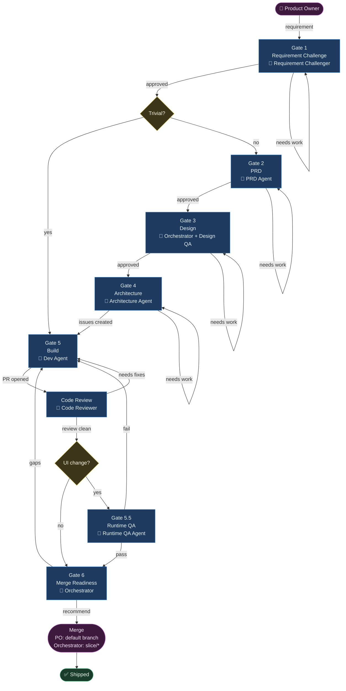

# Agentic Workflow — tark-vitark

## Gates at a Glance

| Gate | Who | Output |
|---|---|---|
| 1 — Requirement Challenge | Requirement Challenger | Requirement Context Package |
| 2 — PRD | PRD Agent | PRD Draft Package |
| 3 — Design *(local-only)* | Orchestrator + Design QA Agent | Figma frames + QA verdict |
| 4 — Architecture | Architecture Agent | Architecture plan + task issues |
| 5 — Build | Dev Agent | Code + tests + PR |
| Code Review | Code Reviewer | Latest Copilot review body says `generated 0 comments` (or equivalent) |
| 5.5 — Runtime QA | Runtime QA Agent | Browser journey verdict |
| 6 — Merge Readiness | Orchestrator | Merge recommendation |

> **Trivial slices** (copy, config, favicon) skip Gates 2, 3, and 4.
> **Default-branch merges** are performed by the Product Owner directly. For PRs targeting `slice/*` integration branches, the Orchestrator may merge under the documented exception.
